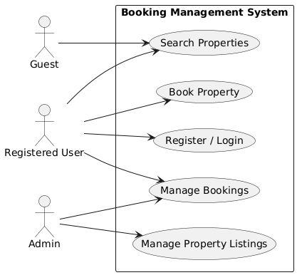

# Requirement Analysis in Software Development

## Introduction
This repository contains the requirement analysis documentation for a **Booking Management System**.  
The goal is to simulate a real-world requirement analysis phase of the **Software Development Lifecycle (SDLC)**.  

It covers:  
- Explanation of requirement analysis  
- Types of requirements (functional and non-functional)  
- Key activities in requirement analysis  
- Use case diagrams for the booking system  
- Acceptance criteria examples  

This structured documentation provides a strong foundation for the design and development phases of the project.

## What is Requirement Analysis?

Requirement Analysis is a critical phase in the **Software Development Lifecycle (SDLC)** where the project team **gathers, analyzes, and defines** the requirements of the software product to be developed.  

It ensures that:  
- Stakeholders have a clear and mutual understanding of what the system should do.  
- Ambiguities and misunderstandings are reduced early in the process.  
- Development teams have a precise roadmap for implementation.  

This process sets the foundation for the **design, development, and testing** phases, making sure the final product aligns with stakeholder needs and business objectives.

## Why is Requirement Analysis Important?

Requirement Analysis plays a vital role in the **Software Development Lifecycle (SDLC)** because it provides a clear direction for the project.  

Key reasons include:  

1. **Clarity and Understanding**  
   - Helps stakeholders and developers achieve a shared understanding of the project goals.  
   - Reduces ambiguity and prevents miscommunication.  

2. **Scope Definition**  
   - Clearly defines the project scope and prevents scope creep.  
   - Ensures that the team only builds what is required.  

3. **Basis for Design and Development**  
   - Provides a strong foundation for system design, architecture, and development.  
   - Ensures that developers work towards well-defined requirements.  

4. **Cost and Time Estimation**  
   - Makes it possible to estimate resources, budget, and timelines more accurately.  
   - Prevents costly rework by catching issues early.  

5. **Quality Assurance**  
   - Ensures the final product meets user expectations and business needs.  
   - Improves customer satisfaction and product reliability.  

## Key Activities in Requirement Analysis

Requirement Analysis consists of several important activities that ensure the system is well-understood before development begins.  

### 1. Requirement Gathering 🗂️
- **Interviews:** Collect detailed information from stakeholders.  
- **Surveys/Questionnaires:** Capture requirements from a larger audience.  
- **Workshops:** Collaborate with stakeholders to refine needs.  
- **Observation:** Study end-users in their real environment.  
- **Document Analysis:** Review existing systems and documentation.  

### 2. Requirement Elicitation ✍️
- **Brainstorming:** Generate ideas and explore possible solutions.  
- **Focus Groups:** Conduct group discussions with selected stakeholders.  
- **Prototyping:** Use mockups or prototypes to clarify requirements.  

### 3. Requirement Documentation 📚
- **Requirement Specification Document (SRS):** Formal record of all requirements.  
- **User Stories:** Describe functionalities from the user’s perspective.  
- **Use Cases:** Show system interactions through diagrams.  

### 4. Requirement Analysis and Modeling 📊
- **Prioritization:** Rank requirements based on importance and impact.  
- **Feasibility Analysis:** Assess if requirements are realistic within constraints.  
- **Modeling:** Create diagrams (e.g., DFDs, ER diagrams) to visualize requirements.  

### 5. Requirement Validation ✅
- **Review and Approval:** Confirm requirements with stakeholders.  
- **Acceptance Criteria:** Define measurable conditions for success.  
- **Traceability:** Ensure all requirements are covered during development and testing.  

## Types of Requirements

Requirements are generally classified into two categories: **Functional** and **Non-functional.**

### Functional Requirements ⚙️
**Definition:** Functional requirements describe *what the system should do* — the core features and capabilities that the software must provide.  

**Examples for the Booking Management System:**  
- **Search Properties:** Users can search for properties by location, price, and availability.  
- **User Registration:** New users can create an account and log in securely.  
- **Property Listings:** Display available properties with details and images.  
- **Booking System:** Users can book properties, view booking details, and manage reservations.  
- **User Authentication:** Ensure secure login and access control.  

### Non-functional Requirements 🛡️
**Definition:** Non-functional requirements describe *how the system should perform*. They define quality attributes such as performance, security, and usability.  

## Use Case Diagrams 📊

### What are Use Case Diagrams?
Use case diagrams are visual representations that show **how different users (actors) interact with a system** to achieve specific goals (use cases).  

They are widely used in requirement analysis to:  
- Provide a clear visual representation of system functionality.  
- Help identify and organize system requirements.  
- Facilitate communication between stakeholders and developers.  

### Booking Management System Use Case Diagram

**Actors:**  
- **Guest:** A user who can browse and search properties without registering.  
- **Registered User:** A user who can register, log in, and book properties.  
- **Admin:** A system administrator who manages property listings and bookings.  

**Use Cases:**  
- Search Properties  
- Register / Login  
- Book Property  
- Manage Bookings  
- Manage Property Listings  

📌 *Diagram:*  

**Examples for the Booking Management System:**  
- **Performance:** The system must load pages within 2 seconds and support at least 1000 concurrent users.  
- **Security:** Data should be encrypted, with secure login and protection against vulnerabilities.  
- **Scalability:** The system must handle increased traffic through horizontal scaling.  
- **Usability:** The user interface should be simple, intuitive, and easy to navigate.  
- **Reliability:** Ensure 99.9% uptime and fast recovery from failures.  

